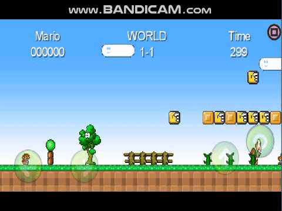
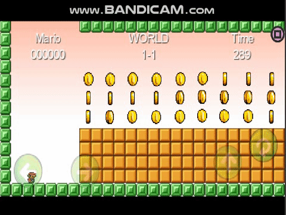
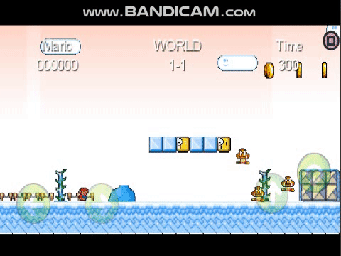

# MARIO REMAKE
------
## Thành viên
------
* 16521022 Nguyễn Huỳnh Sáng
* 16521009 Bùi Đang Quy
* 16520742 Nguyễn Ngọc Nhật Mình
## Giới Thiệu Game
Mario (Tiếng Nhật:マリオ) là nhân vật trong game được tạo bởi nhà thiết kế game người Nhật Shigeru Miyamoto. Mario đã trở thành linh vật biểu trưng cho hãng Nintendo. Mario được phát họa với dáng lùn, là người anh song sinh của Luigi. Nguyên bản Mario được thiết kế trên nền đồ họa 2D, nhưng với những phiên bản sau này được thiết kế với đồ họa 3D.

Mario được mô tả là thợ sửa ống nước người Ý với chiều cao 155 cm, dáng vẻ bệ vệ, sống ở Vương quốc Nấm (Mushroom Kingdom). Anh ta được biết đến với việc thường xuyên ngăn trở kế hoạch bắt cóc Công chúa Peach và thôn tính Vương quốc Nấm của Bowser. Trở thành linh vật của Nintendo, Mario được bình chọn là nhân vật nổi tiếng nhất trong lịch sử video game. Với việc bán được hơn 193 triệu bản, loạt game Mario trở thành loạt game bán chạy nhất trong lịch sử.
## Project
  * Đồ án Java: Mario Remake sử dụng thư viện libgdx
 [Libgdx](https://libgdx.badlogicgames.com/download.html)
 -----
## GameMap
### Level 1-1

### UnderGround

### Level 1-2

-----
## Cài đặt
 ### Các phím điều hướng trên PC

| Phím          | Chức năng        | 
| ------------- |-----------------:| 
| Left arrow    | move left        | 
| Right arrow   | move right       |   
| Up arrow      | jump             |    
| Down arrow    | not set yet?      |    
| Q             | Reset player     |   
| W             | Grow player      |    
| E             | Kill player      |    
| F             | use fireball     |
| H             | immortal mario   |
| A             | change scene    |

## Các Công cụ cần thiết
### Framework 
 * [Libgdx](https://libgdx.badlogicgames.com/download.html)
### IDE
 *  [Android Studio](https://developer.android.com/studio/)
### Tool

 *  [Mapediptor](https://www.mapeditor.org/)
 *  [GDX texturepacker gui](https://code.google.com/archive/p/libgdx-texturepacker-gui/downloads)
## Tutorials
* [LibGdx Tutorials](https://github.com/libgdx/libgdx/wiki/Box2d)
